## 1. Installation

To annotate images, we will use **Napari**, an interactive viewer for multi-dimensional images in Python. Follow the steps below to install Napari locally.

1. **Install Anaconda**
   Download and install the [Anaconda distribution](https://www.anaconda.com/download).

2. **Restart your computer**
   This ensures Anaconda is properly installed and recognized by your system.

3. **Create a new Conda environment**
   Open a new terminal and run:
```bash
conda create -n annotation python=3.11
```

4. **Activate the environment**
```bash
conda activate annotation
```

5. **Install Napari and dependencies**
```bash
conda install -c conda-forge napari pyqt
```

6. **Verify the installation**

```bash
napari --version
```

You should see something like: *napari version X.X.X*
## 2. Workflow

The objective is to create a precise mask over the cells. This mask is called "ground truth" (GT) and can be used for evaluating segmentation models or directly for training deep learning models.

It is essential to apply meticulous attention to mask creation, as we are looking for the finest details in the image, especially precise contours.

<div style="display: flex; gap: 20px;">
   <div align="left">
      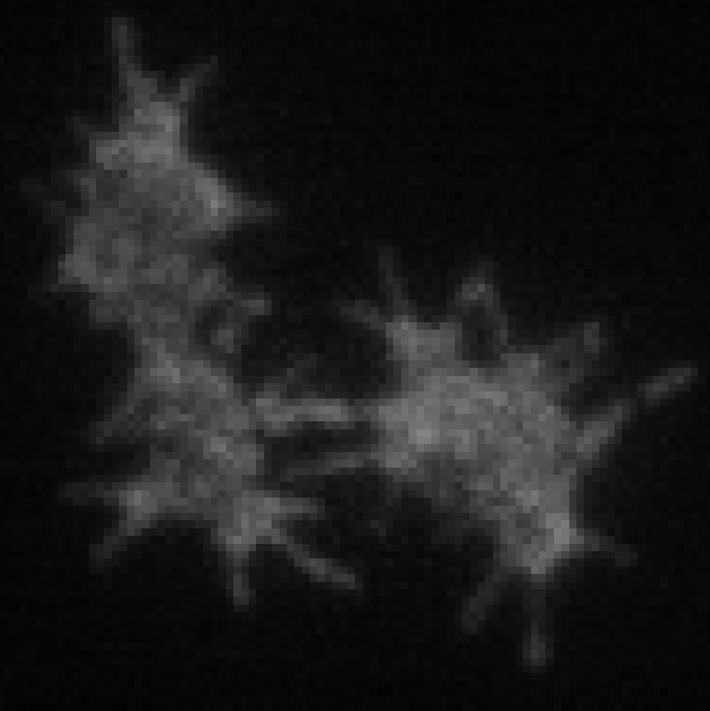
      <p><em>Original grayscale image (.tif)</em></p>
   </div>
   <div align="left">
      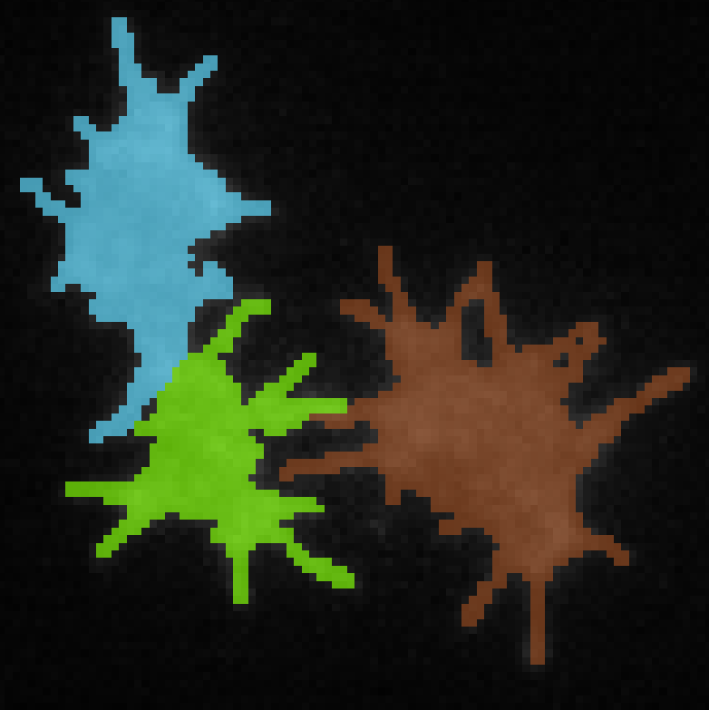
      <p><em>Expected mask (.npz)</em></p>
   </div>
</div>

If your environment is not activated, use the following command:
```bash
conda activate annotation
```

To launch **Napari**, execute:
```bash
napari
```

A window like this should appear:

<div align="left">
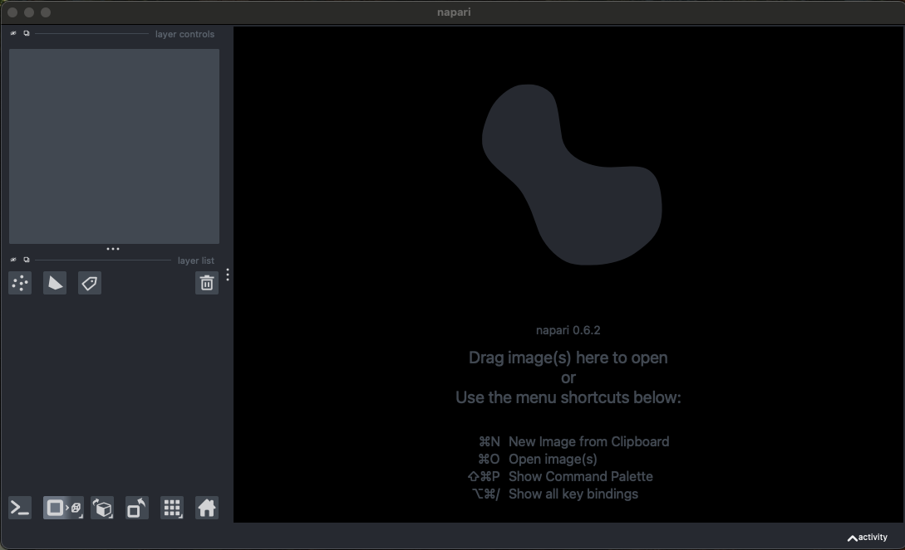
</div>

To annotate an image, you will receive:
- A grayscale format image (.tif)
- An initial mask (.npz) to optimize

Start by dragging and dropping these two files into the Napari interface.

<div align="left">
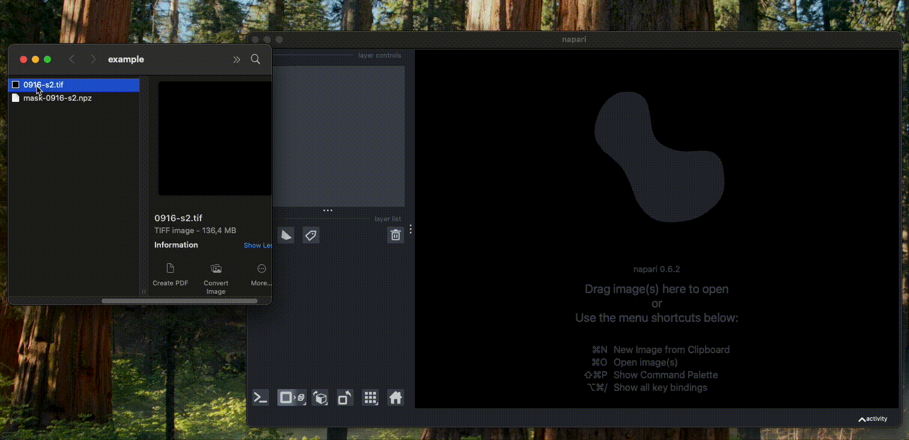
</div>

Make sure the mask is above the image in the layer list (on the left side of the Napari interface). You can vertically reorganize the layer list by dragging them.

### Annotation controls

Start by selecting the mask in the layer list. Let's focus on the controls located on the top left side of the interface. Here is the list

of the most used tools when annotating images:

<table style="border: none; border-collapse: collapse;">
<tr>
   <td style="border: none; vertical-align: top;">
      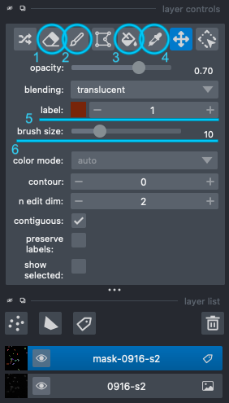
   </td>
   <td style="border: none; vertical-align: top;">
   <ol style="margin-top: 0; padding-top: 0;">
      <li>Label eraser: A brush to remove all IDs from the current image.</li>
      <li>Paint brush: A brush to paint the selected ID on the current image.</li>
      <li>Fill bucket: Replaces the clicked ID and all adjacent pixels with the selected ID.</li>
      <li>Pick mode: Selects the clicked ID.</li>
      <li>Label selector: Allows you to manually set the painting ID (displays the paint color)</li>
      <li>Brush size: Modifies the brush size.</li>
   </ol>
   </td>
</tr>
</table>

### Navigation between frames

You can use the frame slider at the bottom of the GUI to navigate between frames and get pointer related informations.

<div align="left">
   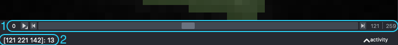
</div>

**1 - Frame slider**: Allows navigation between different images in the series. You can also click the arrows or use the left and right arrows on your keyboard.

**2 - Pointer information**: Shows your pointer coordinates in the format [Frame Height Width] (height and width in pixels). The last digit (outside of the brackets) corresponds to the label you are currently pointing at (if none, the mask is not selected in the layer list).

### Creating Ground Truth Masks

We will focus on a specific case of 3 adjacent cells to understand how to properly create the ground truth mask.

<div align="left">
   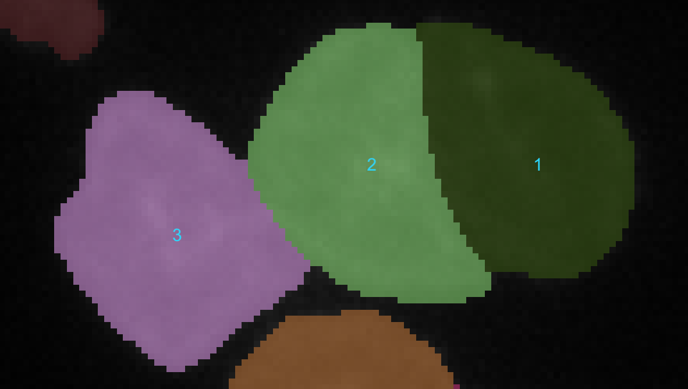
   <p><em>Zoomed image - last frame</em></p>
</div>

#### Step 1: Determine the actual number of cells

The first step is to identify whether there are actually 3 cells, or if the model made an error. To do this, we start by hiding the mask layer. We use the frame slider to go back to the appearance of these cells.

<div align="left">
   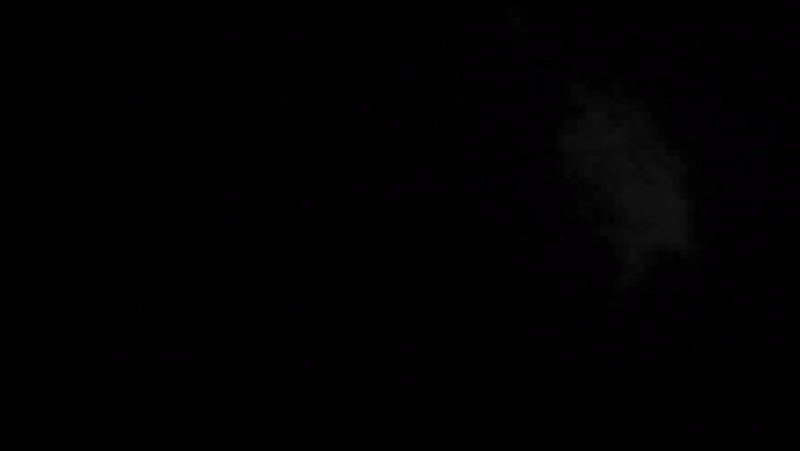
   <p><em>Cell 1 appearance - stops at frame 79</em></p>
</div>
<div align="left">
   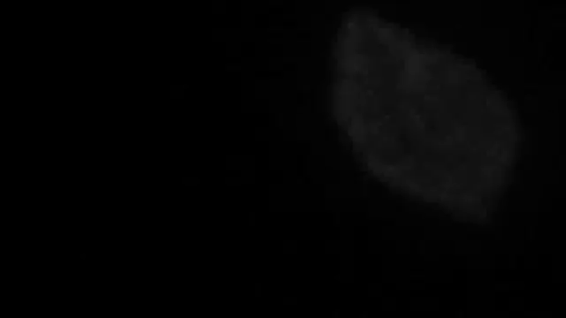
   <p><em>Cell 2 appearance - starting from frame 80</em></p>
</div>

We can clearly observe that a second cell appears, attached to the first but distinct. Such spontaneous appearance can indicate this. Additionally, when cell 2 appears, we can see protrusions forming around the new cell. These are called **filopodia**.

> **Important note:** Filopodia point toward the center of the cell.

We can therefore be certain that two cells exist starting from frame 80. Similarly, we can see in the following animation the appearance of the 3rd cell.

<div align="left">
   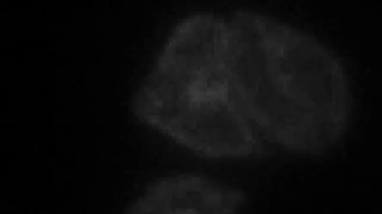
   <p><em>Cell 3 appearance - starting from frame 163</em></p>
</div>

#### Step 2: Identifying model errors and corrections

**Common model inconsistencies include:**
- **ID switching:** Changes cell IDs from one image to another (tracking errors)
- **Cell merging:** Groups multiple cells into one across some or all images
- **Missing cells:** Fails to detect existing cells
- **False positives:** Predicts cells that don't exist
- **Over-segmentation:** Predicts multiple cells where only one exists

⚠️ **Warning:** There are cases where the model predicts a single cell across all frames when multiple cells actually exist. It's important to detect this knowing about filopodia orientation.

**Example of errors:**

<div align="left">
   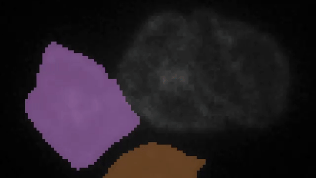
   <p><em>Multiple errors in a few frames</em></p>
</div>
In this example, the base prediction has many ID changes, loses cell tracking, and sometimes merges cells 1 and 2.

#### Step 3: Preliminary correction workflow

It is essential to perform preliminary work to assign a unique ID to each cell throughout the time series.

**Correction procedure:**
1. **Select the most frequent ID** for each cell by observing which ID appears most often for that specific cell across frames.
2. **Navigate frame by frame** starting from the beginning and replace incorrect predictions using the **Fill bucket** tool.
3. **Skip frames without predictions** - ignore these frames as you will rework this part later during detailed annotation.
4. **Handle merged cells** - if the model fuses multiple cells together, use the **Label eraser** to remove all erroneous masks

By reviewing all images systematically, we can eliminate the model's gross errors and fill in the gaps during the second step of detailed annotation.

⚠️ **Important:** Each cell must have a different unique ID. When manually choosing an ID, ensure it's not already used by another cell.